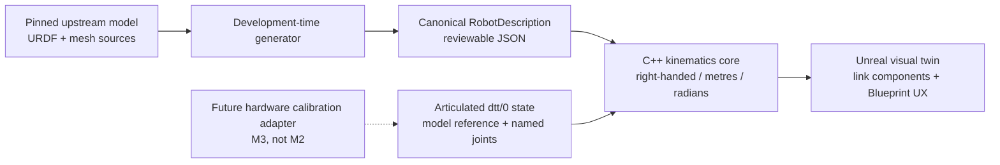
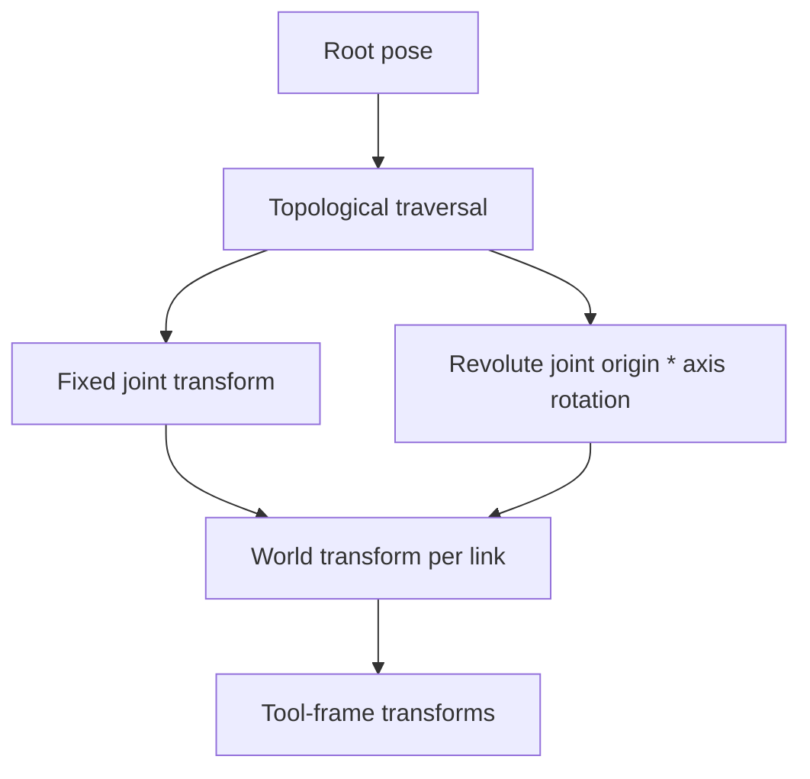
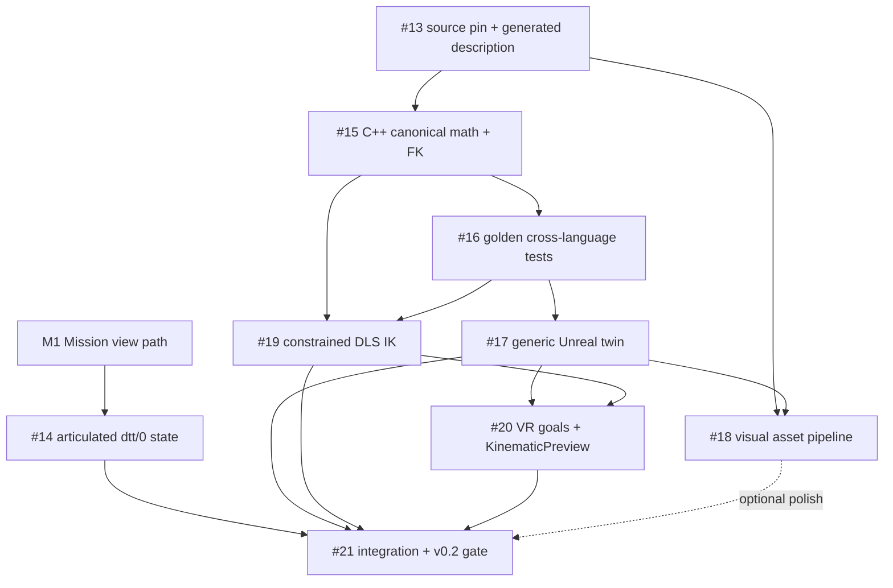

# M2 design — SO-101 mathematical twin and VR kinematic authoring

Status: **implementation in progress**  
Parent epic: [#12](https://github.com/YannickPr/Deferred-Teleoperation/issues/12)  
Target release: `v0.2.0`  
Last reviewed: 2026-09-04

## 1. Purpose

M2 replaces the M1 dummy geometry with a tested mathematical SO-101 twin. It lets an operator author an end-effector goal in desktop or VR, solve a bounded kinematic problem and inspect a time-sampled preview.

M2 is deliberately not a physics or hardware milestone.

```text
named articulated state
-> canonical robot math
-> link and tool transforms
-> Unreal rigid link components

VR/desktop end-effector goal
-> constrained IK
-> target articulated state
-> KinematicPreview
```

The visible result is three independent SO-101 twins:

```text
CONFIRMED — opaque
last articulated Field evidence received by Mission

ARRIVAL — white transparent
articulated state projected for the arrival time of a new intent

TARGET — blue transparent
conditional state authored locally and solved kinematically
```

## 2. Non-goals

M2 does not implement:

- a connection to the physical SO-101;
- raw encoder or LeRobot calibration conversion;
- virtual servos or communication-bus latency;
- Chaos rigid-body dynamics;
- contact or collision-safe planning;
- the physical `PressButton` skill;
- Learning Agents or policy training;
- dense environment reconstruction;
- a generic runtime URDF importer;
- an exact arbitrary six-degree-of-freedom IK claim.

A result produced in M2 is a `KinematicPreview`, never a certified or collision-safe `MotionPlan`.

## 3. Architectural boundaries

M2 keeps four concerns separate.



### 3.1 Structural description

Describes morphology and geometry independent of one physical unit:

- links;
- fixed and revolute joints;
- parent/child relationships;
- joint axes;
- zero-configuration transforms;
- structural limits;
- tool frames;
- joint groups;
- logical visual references.

### 3.2 Hardware calibration

Maps one physical device into the canonical structure:

- raw ticks or device values;
- homing offsets;
- direction/drive mode;
- measured ranges;
- LeRobot normalization;
- possible backlash/servo calibration.

This is intentionally deferred to M3. It must not be embedded in the structural model.

### 3.3 Protocol/runtime state

Identifies a structural model and provides the current canonical joint values. Wire semantics do not depend on array order, Unreal package paths or device ticks.

### 3.4 Visual assets

Map logical visual identifiers onto Unreal Static Mesh assets. Visual origin transforms come from the structural description. Replacing the visual pack must not change FK or IK.

## 4. Pinned SO-101 source

Selected structural source:

```text
repository:
  https://github.com/TheRobotStudio/SO-ARM100

licence:
  Apache-2.0

repository commit:
  385e8d7c68e24945df6c60d9bd68837a4b7411ae

URDF path:
  Simulation/SO101/so101_new_calib.urdf

URDF blob SHA:
  9552a231d8b23bed68ec15779eba620c5d875ec4
```

The implementation must verify these values and record exact source hashes. The normal build/test path must not depend on live network access.

The upstream model README documents two calibration conventions and states that the LeRobot gripper convention (`0` closed, `100` open) is not reflected in the current URDF/MuJoCo files. M2 therefore treats the gripper structural joint and device command normalization as distinct concepts.

Initial semantic choices, subject to source validation:

```text
root link:       base_link
tool frame:      gripper_frame_link
arm joint group: shoulder_pan
                 shoulder_lift
                 elbow_flex
                 wrist_flex
                 wrist_roll

gripper group:   gripper
```

The arm IK group excludes the gripper actuator.

## 5. Development-time model pipeline

Unreal does not parse arbitrary URDF at runtime in M2.

```text
pinned source
-> verify source hash and licence metadata
-> parse supported URDF subset in Python
-> validate tree and units
-> produce deterministic canonical JSON
-> load the canonical JSON in Python and C++
```

Repository layout for the first model increment:

```text
robots/so101/
├── source-lock.toml
├── README.md
├── upstream/
│   └── so101_new_calib.urdf
├── generated/
│   └── so101.kinematics.json
├── visuals/
│   └── visual-bindings.example.json
python/src/deferred_teleop/robot_model/
└── so101.py
```

The generated description should remain small and reviewable. It should not become a copy of every URDF feature.

### 5.1 Supported source subset

M2 needs only:

- `robot`;
- `link` names;
- `joint` names and types;
- `parent` and `child`;
- `origin xyz/rpy`;
- `axis xyz`;
- joint position limits;
- visual mesh references and visual origins;
- fixed tool-frame joints.

Inertial and collision data may be preserved for future work, but they are not authoritative or required by the M2 runtime.

### 5.2 Generated data

```text
RobotDescription
- schema_version
- model_id
- model_revision
- source_manifest
- root_link
- links[]
- joints[]
- joint_groups[]
- tool_frames[]
- visual_entries[]
```

Generated ordering is deterministic. Every object has a stable name. Runtime code validates once and converts names to compact indices.

## 6. Canonical transform convention

Use explicit robotics notation:

```text
^A T_B
```

means the rigid transform that maps coordinates expressed in frame `B` into frame `A`.

Use column vectors:

```text
^A p = ^A T_B * ^B p
```

Composition is:

```text
^A T_C = ^A T_B * ^B T_C
```

Canonical units and basis:

```text
right-handed
Z up
metres
radians
double precision internally
unit scale only
```

For a revolute joint whose axis is expressed in the joint frame:

```text
^parent T_child(q)
  = ^parent T_joint_origin
    * Rot(axis, q)
```

The Python generator converts URDF `xyz/rpy` into an explicit canonical rigid transform. The implementation must document and test the URDF fixed-axis RPY convention; no implicit Unreal Euler convention is allowed.

## 7. Unreal conversion boundary

Unreal uses a left-handed Z-up world with centimetres. Conversion is isolated after canonical FK.

For canonical position `p_c`:

```text
S = diag(1, -1, 1)
p_ue_cm = 100 * S * p_c
```

For canonical rotation matrix `R_c`:

```text
R_ue = S * R_c * S
```

The conversion should operate through matrices/bases before creating an Unreal quaternion/transform. Do not guess quaternion component sign changes.

Required tests:

- identity;
- canonical basis vectors;
- positive and negative quarter turns around X, Y and Z;
- rotation plus translation compositions;
- canonical -> Unreal -> canonical round trip;
- metre-to-centimetre scaling exactly once;
- no negative or arbitrary Actor scale used to repair handedness.

## 8. C++ runtime design

Keep the existing compiled module:

```text
DeferredTeleopRuntime
```

Use source folders rather than new modules until a real dependency boundary appears.

```text
Source/DeferredTeleopRuntime/
├── Public/
│   ├── RobotModel/
│   ├── Kinematics/
│   ├── Visualization/
│   └── VR/
└── Private/
    ├── RobotModel/
    ├── Kinematics/
    ├── Visualization/
    ├── VR/
    └── Tests/
```

Suggested C++ concepts:

```text
FDttRigidTransform
FDttRobotLinkDescription
FDttRobotJointDescription
FDttJointGroupDescription
FDttToolFrameDescription
FDttRobotDescription
FDttNamedJointPosition
FDttJointStateVector
FDttForwardKinematicsResult
FDttEndEffectorGoal
FDttIkSettings
FDttIkResult
FDttKinematicPreview
```

### 8.1 Internal indexing

At model validation time:

```text
link name  -> link index
joint name -> joint index
tool name  -> link/frame index
```

Hot paths use ordered arrays. Wire and authoring APIs retain semantic names.

### 8.2 Error policy

No silent fallback to identity or zero state.

Return explicit results for:

- invalid model;
- unknown or duplicate joint;
- missing required joint;
- non-finite state;
- invalid axis;
- disconnected or cyclic tree;
- model-reference mismatch;
- conversion failure.

The visual layer preserves the last valid state and exposes the error/freshness condition.

## 9. Generic tree FK

The algorithm is generic over a validated rooted tree, not hard-coded to the SO-101 sequence.



Required output:

```text
model reference
root transform
ordered link transforms
named tool transforms
joint state used
diagnostics
```

FK reports limit violations but does not silently clamp them. Clamping belongs to an explicit calling policy.

## 10. Cross-language golden evidence

One fixture set is shared by Python and Unreal tests.

```text
fixture_version
model_reference
root_pose
named_joint_positions_radians
expected_link_transforms
expected_tool_transforms
source/generator metadata
tolerances
```

Minimum cases:

- canonical zero;
- single positive and negative joint rotations;
- shoulder/elbow combination;
- non-trivial all-arm-joint vector;
- fixed tool-frame propagation;
- joint-limit boundaries;
- invalid names, duplicates and missing values.

Fixtures must avoid symmetric states that hide sign or composition errors.

The Python oracle implements the same documented mathematics independently of the C++ code. C++ tests consume committed expected results rather than generating their own oracle at runtime.

Use Unreal Automation Tests for deterministic low-level C++ validation. Tests should live under
`Private/Tests` and run from an Unreal command line on Windows, the reference Unreal platform.
Portable model-generation and fixture checks continue to run on Linux and Windows through Python
CI; M2 does not claim Unreal Editor or runtime support on Linux.

## 11. Unreal actor/component design

```text
ADttKinematicRobotActor
└── RootComponent
    ├── LinkFrame[base_link]
    │   └── VisualComponents[]
    ├── LinkFrame[shoulder_link]
    │   └── VisualComponents[]
    ├── ...
    └── ToolFrameDebugComponents[]
```

Link-frame components are preferably attached flat under the actor root and receive explicit transforms from FK. Unreal's component hierarchy must not become an implicit second forward-kinematics implementation.

Visual components apply only the link-relative visual origin.

C++ owns:

- validated model loading;
- link-component topology;
- state-to-FK application;
- canonical/Unreal conversion;
- named transform access;
- errors and update events.

Blueprint owns:

- materials;
- confirmed/arrival/target styling;
- labels and frame-axis toggles;
- example scenes;
- operator interaction;
- trajectory rendering.

Start with debug axes and primitives. Official static meshes are a parallel enhancement, not a mathematics gate.

## 12. Visual asset pipeline

The upstream URDF references per-part STL files. M2 should use an explicit development-time conversion/import procedure rather than an undocumented series of editor clicks.

Candidate path:

```text
pinned STL files
-> verify hashes and attribution
-> deterministic conversion to GLB/glTF or documented Interchange source
-> Unreal Static Mesh import
-> logical visual ID to Soft Object Path binding
```

The core canonical description never contains Unreal package paths.

Validation includes:

- link origin alignment;
- expected dimensions/bounds;
- non-trivial articulated pose;
- tool frame independent of mesh origin;
- debug frames overlaying the visual model;
- visual pack removal does not break kinematics.

No collision or dynamics quality claim is made for these meshes in M2.

## 13. Articulated protocol extension

M1's minimal `RobotState` is intentionally insufficient for M2. M1 is now released as `v0.1.0`;
the articulated extension builds on those merged models rather than redefining them.

Proposed additions:

```text
RobotModelReference
- model_id
- model_revision
- description_hash

JointPosition
- joint_name
- position_radians

RobotState
- robot_id
- model_reference
- root_pose
- joint_positions[]
- evidence
```

Wire order has no semantic meaning. Runtime code validates names against the model and converts to indices.

The gripper must not be smuggled into the same field using a normalized 0-100 value. Either omit it from the first arm-state fixture or define a distinct typed actuator-state domain.

Mission view data carries three articulated states with independent provenance:

```text
confirmed_robot_state
arrival_robot_state
target_robot_state
```

## 14. IK task model

The SO-101 arm group has five joints controlling tool pose. M2 avoids pretending it can exactly satisfy every arbitrary six-dimensional pose.

### 14.1 Position-only mode

Error:

```text
e_p = p_goal - p_tool
```

Three constrained components.

### 14.2 Position plus approach-axis mode

Constrain position plus alignment between a configured tool axis and desired canonical direction. Roll about that axis remains unconstrained.

A practical orientation error is based on the cross product between current and desired unit approach axes. It has at most two independent constraints.

This gives up to five independent task constraints, matching the five arm joints.

### 14.3 Geometric Jacobian

For revolute joint `i` in a common frame:

```text
Jv_i = axis_i × (p_tool - p_joint_i)
Jw_i = axis_i
```

The task Jacobian selects or transforms these rows for the active mode.

### 14.4 Damped least squares

Conceptually:

```text
Δq = Jᵀ (J Jᵀ + λ² I)⁻¹ e
```

Implementation requirements:

- warm start;
- finite inputs;
- bounded damping;
- maximum step;
- joint-limit projection;
- stagnation detection;
- maximum iterations/time;
- rich status and residuals;
- deterministic behavior for fixed inputs/settings.

Suggested statuses:

```text
CONVERGED
PARTIAL
UNREACHABLE
INVALID_INPUT
NUMERICAL_FAILURE
ITERATION_LIMIT
```

A partial result may be visualised but is not automatically executable.

## 15. VR and desktop authoring

Both interaction modes produce the same canonical object:

```text
EndEffectorGoal
- goal_id
- tool_frame_name
- task_mode
- target_position_m
- desired_approach_axis
- reference_frame
- authored_at
```

The target object's Unreal transform crosses the Unreal/canonical boundary once. The solver never consumes an Unreal world transform directly.

Required interaction behavior:

- move the target in desktop mode;
- grab/move it in VR;
- switch task mode;
- reset to current tool pose;
- freeze one candidate target;
- display achieved tool pose and residual;
- preserve the last valid target state on failure.

Cap solve frequency and coalesce stale hand/controller updates. Do not run an uncontrolled solve for every render-frame event.

## 16. Kinematic preview

The initial preview interpolates in joint space and samples explicit times.

```text
KinematicPreview
- preview_id
- start state reference
- target state
- timed joint samples
- timed tool samples
- duration
- generation method
- limitations
```

A reasonable first timing model is:

```text
duration = max_i(abs(q_target_i - q_start_i) / preview_velocity_i)
```

with configured minimum duration and a smooth interpolation parameter for visual continuity. Preview velocity limits are presentation/planning assumptions, not validated hardware limits.

Every tool sample is recomputed through FK. Rendering may interpolate the committed samples, but the original samples remain inspectable.

## 17. Dependency graph



## 18. Recommended PR sequence

```text
1. feat(robot-model): pin and generate the SO-101 description        #13
2. feat(kinematics): canonical rigid transforms and generic FK       #15
3. test(kinematics): shared golden fixtures and Unreal tests         #16
4. feat(unreal): generic debug-geometry kinematic twin               #17
5. feat(protocol): articulated robot state and model references      #14
6. feat(ik): constrained DLS solver                                  #19
7. feat(vr): goal authoring and KinematicPreview                     #20
8. feat(assets): attributed SO-101 visual pack                       #18, parallel/stretch
9. feat(m2): integrate three state layers and release evidence       #21
```

Do not stack all implementation PRs simultaneously. Design and fixture work may be prepared early, but active code should remain a narrow vertical thread.

## 19. Weekly visible evidence

The exact calendar is flexible. Preserve one visible result per active week:

1. CLI prints the pinned link/joint/tool tree and source hash.
2. Unreal debug robot moves from a non-trivial joint vector.
3. Link/joint axes overlay a passing golden FK fixture.
4. A desktop target drives position-only IK.
5. Approach-axis mode visibly changes the tool orientation and reports residuals.
6. Confirmed, arrival and target twins coexist with a timed trajectory line.
7. Optional static meshes align with the same debug frames.
8. Short VR capture exercises the final authoring flow.

## 20. Risk register

### Coordinate or transform-order error

Mitigation: one canonical notation, independent Python oracle, axis/quarter-turn tests and one conversion boundary.

### Structural/hardware calibration confusion

Mitigation: separate source model, device calibration adapter, wire state and visual pack. Defer raw/LeRobot conversion to M3.

### Gripper convention mismatch

Mitigation: separate arm and gripper groups; no silent 0-100-to-radian mapping.

### Over-generalised robot framework

Mitigation: support only validated fixed/revolute rooted trees required by the SO-101 while keeping names and data structures generic.

### IK instability in VR

Mitigation: warm starts, update-rate cap, coalescing, bounded steps, rich statuses and last-valid-state retention.

### Binary assets block progress

Mitigation: debug primitives are the mathematical release baseline; visual pack is parallel and removable.

### M1 protocol compatibility

Mitigation: M2 math/model work remains independent. The articulated protocol extension builds on
the released M1 models and retains the experimental `dtt/0` compatibility boundary explicitly.

### Blueprint becomes a hidden second core

Mitigation: C++ owns canonical math and preview data; Blueprint owns interaction and presentation.

### Misleading public safety claims

Mitigation: consistently call the result `KinematicPreview`; document absent collision, dynamics and hardware validation.

## 21. Release gate

`v0.2.0` requires:

- reproducible pinned model generation;
- source attribution and notices;
- passing Python and Unreal golden FK tests;
- passing canonical/Unreal conversion tests;
- explicit tool frame;
- confirmed/arrival/target articulated states;
- position-only and approach-axis IK with residual/status reporting;
- time-sampled KinematicPreview;
- desktop and VR visible evidence;
- Windows UE 5.8 verification on the reference Unreal platform;
- portable Python generation and fixture verification on Linux and Windows;
- no hardware dependency;
- documentation that accurately excludes physics, collision and safety guarantees.

High-fidelity static meshes are desirable but do not override mathematical correctness. A debug-geometry build remains a supported fallback.

## 22. Open decisions intentionally deferred

These do not block preparation:

- exact visual import tool and GLB conversion utility;
- final tool approach-axis convention for each future skill;
- final gripper hardware mapping;
- whether later stable protocol code generation uses JSON Schema, Protobuf or another IDL;
- collision representation;
- physics/dynamics backend;
- standalone-headset optimisation.

They should be decided only when the first use case exercises them.
