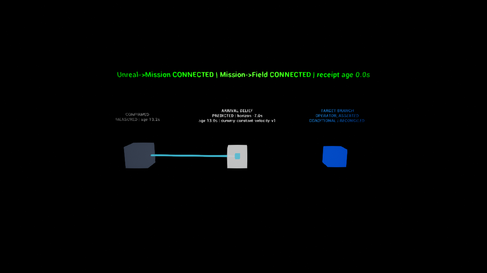

# M1 Unreal visualization proof

The M1 Unreal slice is a read-only view of Mission state. Unreal connects only to the local
Mission WebSocket endpoint; it never connects to Field, the development link, the dummy Robot,
or hardware.

The `BP_M1DeferredStates` example visualizes three deliberately separate states:

- dark opaque: last confirmed state (`MEASURED`);
- white translucent: predicted arrival belief (`PREDICTED`);
- blue translucent: conditional operator target (`OPERATOR_ASSERTED`).

A cyan line and moving marker display the timed trajectory forecast. Labels retain source,
evidence age, arrival horizon, model version, connection state, and reconciliation status.
Disconnecting Mission preserves the last valid view while receipt age increases and the
connection label becomes stale.



## Reproduce the proof on Windows

Generate or update the repository-owned Blueprint, level, and materials:

```powershell
& 'C:\Program Files\Epic Games\UE_5.8\Engine\Binaries\Win64\UnrealEditor-Cmd.exe' `
  'unreal\DeferredTeleopDemo\DeferredTeleopDemo.uproject' `
  -unattended -nop4 -nosplash -NullRHI -run=pythonscript `
  -script='unreal\Scripts\generate_m1_visualization_assets.py'
```

Build the editor target:

```powershell
& 'C:\Program Files\Epic Games\UE_5.8\Engine\Build\BatchFiles\Build.bat' `
  UnrealEditor Win64 Development `
  -Project='unreal\DeferredTeleopDemo\DeferredTeleopDemo.uproject' `
  -WaitMutex -NoHotReloadFromIDE
```

Start the full local delayed-dummy path and leave the Mission view endpoint available:

```powershell
.\.venv\Scripts\python.exe -m deferred_teleop.demo delayed-dummy `
  --profile short-visible-delay `
  --data-dir artifacts\m1-unreal-proof `
  --phase-duration 1 --one-way-delay 0.3 `
  --hold-open-seconds 75 --view-ws-port 8772 --timeout 30 --quiet
```

In another terminal, open the example level. Add `-DttCaptureEvidence` to write a deterministic
1280x720 PNG to `Saved/Screenshots/M1_DeferredStates.png` and exit automatically.

```powershell
& 'C:\Program Files\Epic Games\UE_5.8\Engine\Binaries\Win64\UnrealEditor.exe' `
  'unreal\DeferredTeleopDemo\DeferredTeleopDemo.uproject' `
  /DeferredTeleop/M1/M1_DeferredStates `
  -game -windowed -ResX=1280 -ResY=720 -nosplash -nop4 -DttCaptureEvidence -log
```

The expected log evidence includes `Connected to Mission view`, one accepted
`DTT_M1_VIEW` with all three states, and `DTT_M1_EVIDENCE_SCREENSHOT`.

To exercise a live disconnect after Unreal has attached, launch the level first and then run:

```powershell
.\.venv\Scripts\python.exe -m deferred_teleop.demo delayed-dummy `
  --profile short-visible-fault --restart-mission-after-admission `
  --pre-submit-delay 15 --view-ws-port 8772 --hold-open-seconds 15
```

The Unreal log must show an initial connection and view, a connection close, and a later
connection plus terminal view. The visualization component never clears `LastValidState` on
the disconnect path, so the retained view ages and becomes stale until the next valid frame.

## Automated Unreal checks

Run the parser, rejection-state preservation, and coordinate-conversion tests with:

```powershell
& 'C:\Program Files\Epic Games\UE_5.8\Engine\Binaries\Win64\UnrealEditor-Cmd.exe' `
  'unreal\DeferredTeleopDemo\DeferredTeleopDemo.uproject' `
  -unattended -nop4 -nosplash -NullRHI `
  '-ExecCmds=Automation RunTests DeferredTeleop.M1;Quit' `
  '-TestExit=Automation Test Queue Empty' -log
```

The Blueprint-spawnable `DeferredTeleopMissionClientComponent` exposes the last valid strict
`dtt/0` state and the `OnMissionViewStateUpdated`, `OnMissionConnectionChanged`, and
`OnMissionMessageRejected` events. Malformed or unsupported frames are rejected without
overwriting the last valid state.

## Recorded environment

Verified on 4 September 2026 with Unreal Engine 5.8.2 (build 56702186), Development Editor /
Win64, Visual Studio toolchain 14.44.35228, and Windows SDK 10.0.26100.0. No SO-101,
Simulation Worker, actuator, or hardware-control path was loaded.
